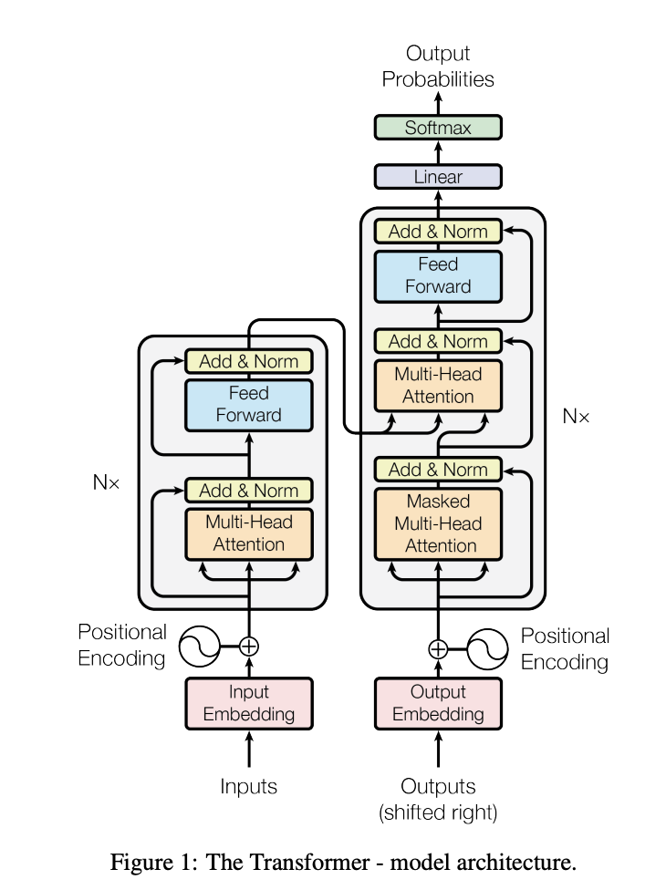

# Transformer-NMT/GPT
Refining my PyTorch skills to build models from scratch [2] - Creating various Transformer-based models:
1. Neural Machine Translation
2. Bigram Language Model (character unit)
3. GPT Language Model (character unit)
4. Refined GPT Language Model (token unit)

*This README will also contain my personal notes as I review key concepts and practice with examples.*
- This project is also to be used as custom tutoring material in the future
NOTE: The NMT is built, trained, and evaluated using Google Colab's cloud resources. It's architecture and comments are documented on a Jupyter/Python notebook: `transformer_nmt.ipynb`.

## NOTES:
### NLTK Library
- As a baseline for working with and building language models, I explore the NLTK library to grasp tokenization practices.
- Allows conveinent, easy parsing of natural language data, used for various NLP tasks and applied models like LLMs.
- Commonly use `punkt`: pretrained, unsupervised model to parse text into tokens based on heuristics.
    - Other tokenizer models can be accessed via the nltk library as well.
- `nltk.download()` downloads sub modules provided by the nltk library; empty argument to view GUI or place package names when instantiating.
    - Use this to download punkt at the beginning of program: `nltk.download('punkt')`.
- `nltk.tokenize.word_tokenize()` splits text into meaningful tokens.
- `nltk.tokenize.sent_tokenize()` splits text by sentences.
- `nltk.probability.FreqDist(tokens)` to turn tokens into frequency distribution.
    - Pair with matlab pyplot to diplay graph.
### NLP
- Stop words are a set of words filtered out during an NLP task to imporve accuracy and remove noise/uncertainty.
    - No universal set of stop words for all tasks
    - Early NLP task/models focused more on topic not deep position/contextual information, so stop words included pronouns like "he"/"she", but these can be important in more complex tasks.
- **Lemmatization** uses collected dictionary (e.g. WordNet) to intelligently reduce words to its base root (e.g. studies -> study, has -> have), whereas **Stemming** uses rule-based truncation logic that is often more harsh and non-intelligent (e.g. studies -> studi, has -> ha).
- Sentiment analysis can be done with static, non-ML based approach like VADER lexicon.
    - VADER is a dictionary of human-rated words, and heuristic rules determine the sentiment of given text.
    - Signals like emphasis, negation, intensity modifier (e.g. very), contribute to the scores.
    - Compound score is often most useful; even if ratio of scores where pos is 1.0 and rest are 0.0, the compound can hint to just how positive the given text was.
- Synonyms / Antonyms can be found using synsets. A synset is a similar concept to the original word.
    - The list of synsets for a given word in the dictionary is ordered by the frequency of the word's usage in the dictionary (e.g. "good" -> "good" as the first synset, but "automobile" -> "car" as it's first synset)
    - `synset.lemmas()` provides all synonym words for a synset.
    - Therefore, by collecting all lemmas for each synset of a given word (double loop), we can effectively collect all synonyms of a word, but this may contain duplicates.
    - Likewise, take `synset.antonyms()` if exists to collect all antonyms.

### Generative Language Models
- Overall the idea of language model is probabilistic prediction.
    - For a bigram model, the next unit of language predicted (char/token/word) depends solely on the previous unit. In other words, it's context size is 1 unit.
    - For a GPT-like language model, the context size is larger, usually referred to a "block" of text being the input for next unit prediction.
- The prediction happens on an encoded version of the Vocabulary (all possible unit of language supported by model)
    - Simple encoder-decoder would map 1-to-1 between language and numerical representation.
        - For more complex encoder/decoders, review: SentencePiece (Google) or tiktoken (OpenAI)
    - Could have larger unit size with larger Vocab and smaller encoding length or smaller unit size with smaller Vocab and larger encoding length
        - In practice, unit is typically a couple chars (tokens, or sub-words), and Vocab is pretty large.
- When training transformers, we typically only train w/ chunks of data sampled from the train data, not the entire text. The block_size here becomes the context size.
- In general, it's a good practice to evaluate the average loss in the middle of training
- During forward pass, we can use Embeddings table to compute logits, which is compared w/ targets to find CE loss.

### Self-Attention Mechanism
- The core logic originally described by the "Attention is All You Need" Paper and adopted into GPT models.
- Given a 3 dimensional Tensor B, T, C (batch, time, channel), and time represents the sequence of tokens in chronological order, we want the token information (channels) at time idx i to communicate with past tokens within the context window.
    - One of the easiest ways to achieve this is via a simple sum or average, and representing the current time idx's channels as the sum/averaged feature value. However, this is extremely naive and loss-y for crucial data like spatial arrangement/order.
        - Similar to pre-fix sums.
- Ultimately, however, we don't want a uniform distribution among weights; instead, we want to be able to represent a data-dependent weight (different tokens take different levels of interest to other tokens).
    - Self-attention solves this via having each tokens emit a KEY and a QUERY value. By taking a dot product, if a key and query has high affinity for each other, there will be stronger value extracted.
        - Each key also holds a unique value for the token.
    - We initially define key, query, value via linear layers, and by having weight be defined as matrix multiplication of query and key's transpose, the resulting weight matrix holds the dot product of token i's query vector with token j's key vector at weight(i, j). This represents how much each token's query attends to another's key.
        - High dot product in the weight matrix for (i, j) represents high attention between token i's query and token j's key.
- By using value projection (another lin. layer to process x -> v), we achieve flexibility in representing the token beyond its raw form, and allow us to manipulate the dimension freely.
- Attention, at core, is a communication mechanism between ANY directed graph structure. In auto-regressive language model, it typically becomes directed w.r.t. time (past tokens point to current), but this can be generalized. (To achieve this, simply remove triangular backfill -inf, which allows all nodes to communicate w/ each other).
- Attention mechanism by itself has no notion of space/position, it only holds relationship between tokens (nodes). Hence, to acheive positional data, we need to positionally encode tokens.
- Self-attention is a special case of attention where key, query, value results from the same source. In a more general setting like a generic encoder-decoder architecture, encoder may pool from a separate source that we want to condition on.
- In the original attention paper, the attention matrix is defined as Softmax((Q@K_T)/sqrt(head_size))@V, where dividing by sqrt(head_size) ensures that the variance of weight (the arg. to softmax) will be within unit Gaussian (1), not head_size.
    - This is crucial because if there are extremes in weight, softmax will converge towards a single high value and leave the rest near 0, which is undesirable (signifies only a single other node is important to any given node)
- PyTorch's matmultiplication (@) operation automatically takes the last 2 dimensions as matrix dims and any leading dims as the batching dimensions, auto-broadcasting if needed.
### Multi-Head Attention
- An architecture described in the attention paper that's essentially multiple self-attention heads in parallel, then concatenated. 
- head_size passed into each Head should be reduced by a factor of 1/n_heads to account for same final dimensions after concatenation.
- This allows for multiple independent channels of communication, which enables more diverse exploration of tokens compared to a single head.
### Transformer Block
- Comprised (at base) of the multi-head attention layer and a feed-forward layer (linear layer + ReLU or other non-linearity)
    - The feed-forward layer gives the model more "time" to make meaningful data out of the attention computation. 
- Allows interlayering the layers for a deeper training.
- Can lead to optimization issue as model becomes deeper -> we need methods to ensure optimizability remains. 
    - Skip/residual connections is one way to achieve this. A residual pathway allows joining the original input w/ processed values via addition.
    - Layer normalization is another highly effective method. 
        - In modern practice, normalization is usually applied BEFORE transformation, unlike the original paper where norm. is applied AFTER.
        - TODO: batch norm vs layer norm?
- To prevent overfitting, dropout layers can be added during every forward/backward pass, as found by "Dropout: A Simple Way to Prevent Neural Networks from Overfitting".
    - This randomly shuts off connection between different nodes in the neural net as a regularization technique.
### Encoder-Decoder Architecture and Cross-Attention Mechanism

- The original attention paper's architecture, as shown above, highlights both an encoder AND a decoder.
    - This is because the original paper was focused on NMT, so encoder took the entire foreign language as input and decoded into a second target language.
    - As part of this, the outputs of encoder leeches onto the decoder via cross-attention layer, which effectively allows decoder to communicate with past tokens AND the entire context of foreign text.
- The GPT-like language model created here ONLY has a decoder part.
    - Decoder is characterized by the lower triangular matrix blocking communication with future tokens.
    - The absence of encoder is because whole context shouldn't be considered, and generation only depends on creating new, high-probability tokens (sort of spitting tokens that should fit without any grounding like NMT)
    - This also leads to absence of cross-attention layer in this GPT model. 
### Scaling Decoder into AI Assistant (e.g. ChatGPT)
- The decoder model created here is similar to the pre-training stage of GPT models.
    - The model architecture is nearly identical, but GPT has million-fold larger training data (a good chunk of internet vs tiny dataset here), and much larger parameter size (and other hyperparameters associated).
    - The output of this pre-training is a document-completer, not a helpful assistant.
- This model then undergoes fine-tuning to perform explicitly assistant-like behaviors, training on curated set of Q&A-like data.
- A human labeler helps to identify while style of prompt-response pair is best, and this information is used to perform policy optimization (PPO).
    - This part of the process is less readily available open-source.

### TODO:
- GPT model
    - refine w/ tokenization, additional layers, and larger language context (OpenWebText)
- figure for GPT-like decoder architecture
- NMT re-creation
- broadcasting pytorch

### Acknowledgements:
NLTK exploration referenced the [Official NLTK Documentation](https://www.nltk.org/) and the following [YouTube tutorial](https://www.youtube.com/@ProgrammingKnowledge) with self-learning and modifications.

The seq2seq Transformer NMT creation follows public material from Princeton University's NLP course, COS484. This material has been modified for personal learning purposes and (will be) extended in self-guided exploration of the model.

The GPT-like Transformer Language Model was created with reference to ["Attention is All You Need"](https://arxiv.org/pdf/1706.03762) by Vaswani et. al.